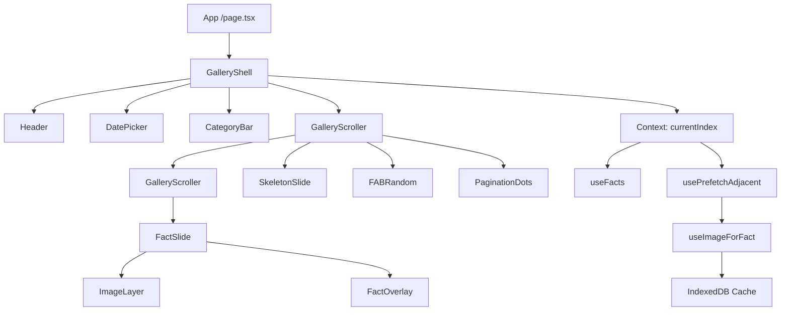

# DAY-LIGHT Frontend Architecture & Gallery Design Plan

## Overview
**DAY-LIGHT (v3.0-final)** is a production-ready Next.js application delivering a cinematic, offline-capable, date-based fact gallery with reliable caching, strong fallback layers, and smooth UX across all devices. Features full-bleed background gallery with client-side caching, fallbacks, gesture navigation, and background image handling. No heavy backend - relies on client-side logic with external APIs.

## Objective
Build a cinematic, offline-capable, date-based fact gallery with reliable caching, strong fallback layers, and smooth UX across all devices.

## Core Focus Areas
1. **Image Engine Reliability** - Must gracefully fail, never block UI
2. **IndexedDB + Service Worker Cache Architecture** - Multi-layer caching with LRU pruning
3. **Gallery Performance & Smoothness** - Zero jank, smooth scrolling/swiping
4. **Fallback Strategies (facts & images)** - Always show something, never blank screens
5. **Prefetching & LRU Pruning** - Smart prefetch with backpressure, automatic cleanup
6. **Date/Category Filtering Accuracy** - Precise filtering without data loss
7. **Client-side Error Recovery** - Graceful degradation at every layer
8. **Progressive Image Loading (LQIP > thumbnail > hi-res)** - Fast perceived performance
9. **Gesture Navigation Stability** - Reliable swipe/tap/long-press handling
10. **Accessibility & Reduced-Motion Compliance** - WCAG AA, prefers-reduced-motion support

## Core Principles
- **Fast First Paint**: Prioritize LQIP, cached thumbnails, progressive hi-res loading
- **Offline Friendly**: IndexedDB primary cache, Service Worker cache, static JSON fallbacks
- **Image-First Design**: Background images as focal point, with overlay text
- **Cinematic Gallery UI**: Full-viewport slides with snap-scroll and parallax
- **Mobile Gesture Support**: Swipe, tap, long-press interactions
- **Low API Calls**: Intelligent caching to minimize network requests
- **Never Block UI**: All async operations must be non-blocking
- **Graceful Degradation**: Multiple fallback layers ensure something always renders
- **Smooth Framer Motion Animations**: Physics-based transitions
- **Accessibility AA**: Keyboard navigation, ARIA labels, contrast compliance, reduced-motion support

## Categories & Fallback Icons
- **Birthdays** (fallback: `person_silhouette`)
- **Historical** (fallback: `landmark_icon`)
- **Science** (fallback: `atom_or_rocket_icon`)
- **Finance** (fallback: `currency_icon`)
- **Sports** (fallback: `stadium_or_ball_icon`)
- **Festivals** (fallback: `colorful_event_icon`)
- **Space** (fallback: `galaxy_placeholder`)
- **PopCulture** (fallback: `music_or_movie_icon`)
- **Awards** (fallback: `trophy_icon`)
- **Technology** (fallback: `chip_or_circuit_icon`)

**Note**: All fallback icons must be precached in Service Worker at `/fallback/{icon_name}.png`

## High-Level UX & Goals
- **Full-bleed gallery**: Each slide is a fact panel with image background and text overlay.
- **Navigation**: Vertical scroll/snap, swipe gestures, keyboard (arrows, space, esc), wheel.
- **Performance**: Fast first-paint with skeleton/LQIP, cached thumbnails, progressive hi-res loading.
- **Infinite-ish feed**: Load chunks (6-12 facts), prefetch next chunk.
- **Animations**: Smooth, physical animations with Framer Motion; prefetch N+1, N+2 images.
- **Fallbacks**: Category icons when no image available.
- **Offline**: Load from IndexedDB/SW cache with static JSON fallback.
- **Accessibility**: Semantic headings, ARIA live regions, screen-reader friendly.

## Core Components & File Structure
```
/app
  layout.tsx                    // Root: theme provider, SW register, top-level context providers
  page.tsx                      // Gallery entry: SSR/ISR for initial date + seed data

/components
  Header.tsx                    // Title, theme toggle, Random Fact button
  DatePicker.tsx                // Date input; emits selected date events
  CategoryBar.tsx               // Filter UI; emits activeCategory
  GalleryShell.tsx              // Root wrapper; manages gallery state (index, slides), gestures
  GalleryScroller.tsx           // Scroll container (snap + virtualization + intersection observer)
  FactSlide.tsx                 // Slide: ImageLayer + FactOverlay
  FactOverlay.tsx               // Title, description (expandable), badges, actions (share/source)
  ImageLayer.tsx                // Image pipeline: LQIP -> cached thumbnail -> hi-res swap
  SkeletonSlide.tsx             // Placeholder & shimmer used while loading
  FABRandom.tsx                 // Floating random fact button; triggers jump/switch
  PaginationDots.tsx            // Current position UI; keyboard focusable

/hooks
  useFacts.ts                   // Orchestrates fetching facts for date: IDB → SW → API → fallback
  useImageForFact.ts            // Returns {thumbnail, hiRes, status, source} and triggers engine
  usePrefetchAdjacent.ts        // Prefetch N adjacent slides (data + images) with backpressure
  useIndexedCache.ts            // Generic IDB wrapper: get/set/delete/iterate + LRU helpers
  useSwipeNavigation.ts         // Gesture to slide index mapping, debouncing and thresholds

/lib
  imageEngine.ts                // Keyword extraction, source fetchers (Wikimedia, NASA), scoring
  storage.ts                    // localStorage & cookie helpers, key constants, versioning
  validators.ts                 // Zod schemas / validation helpers for API payloads

/styles
  globals.css                   // Tailwind imports, fonts, theme vars, CSS utilities

/utils
  math.ts                       // small math utils for parallax & animation calculations
  helpers.ts                    // text helpers, date formatting, slug/normalizeKey

/types
  fact.ts                       // TypeScript interfaces: Fact, FactEntry, ImageMeta, CacheEntry, Category
```

## Critical Components & Responsibilities

### GalleryShell
- **Responsibilities**: Manages active index, gesture handling, slide lifecycle, and provides global gallery context. Must be highly stable.
- **Props**: `initialDate`, `initialCategory?`, `onClose?`
- **Behavior**: 
  - Mounts gallery, sets `overflow: hidden` on body
  - Manages ARIA `role="region"` and `aria-live` for slide changes
  - Must not break during swipe events even if images are missing
  - Handles keyboard navigation (arrows, space, esc)
  - Provides Context for currentIndex/controls

### GalleryScroller
- **Responsibilities**: Executes virtualization, snap-scroll, intersection detection. Controls which slides are visible.
- **Props**: `slides: Fact[]`, `onIndexChange(index: number)`, `prefetchDistance?: number`
- **Implementation**: 
  - Use react-window or simple windowing
  - CSS scroll-snap + IntersectionObserver for active slide detection
  - Max 10 slides in DOM (5 on reduced-memory devices)
  - Prefetch distance: 2 slides ahead/behind

### FactSlide
- **Responsibilities**: Responsible for executing image load timing, active state transitions, and parallax.
- **Props**: `fact: Fact`, `index: number`, `isActive: boolean`, `onEnter()`, `onExit()`
- **Visual**: Full-viewport `position: relative`, background `object-fit: cover`, overlay centered/bottom-aligned.
- **Behavior**: 
  - Supports layout variants (portrait, landscape, square)
  - Manages parallax effect (disabled for prefers-reduced-motion)
  - Triggers image load when slide becomes active or near viewport

### ImageLayer
- **Responsibilities**: Executes image pipeline: fallback -> LQIP -> cached thumb -> hi-res. Must NEVER block UI.
- **Props**: `imageUrl`, `alt`, `priority: boolean`, `fallbackIcon`
- **Behavior**: 
  - Always return fallback immediately; upgrade later
  - Show LQIP if available; display cached thumbnail then swap to hi-res
  - Use `placeholder="blur"` for progressive loading
  - Reject non-image MIME types, reject >2MB files
  - Crossfade duration: 200-350ms

### useFacts Hook
- **Responsibilities**: The core data loader. Must resolve facts from IDB -> SW -> Static JSON -> API safely.
- **Returns**: `{facts, loading, error, refresh}`
- **Contract**: Always return facts instantly (IDB or static) before network calls
- **Fallback Chain**: 
  1. IndexedDB (fresh, TTL 24h)
  2. SW Runtime Cache (JSON)
  3. Static JSON (`/static-data/YYYY-MM-DD.json`)
  4. Minimal Offline Fact (title only)

### useImageForFact Hook
- **Responsibilities**: The image resolver. Connects to imageEngine + SW + IDB. MUST return fallback instantly.
- **Returns**: `{thumbnailUrl, hiResUrl, loading, source, status}`
- **Contract**: Always return fallback immediately; upgrade later
- **Fallback Chain**:
  1. IndexedDB metadata
  2. Service Worker Cache (binary)
  3. Fresh network fetch
  4. Fallback static icon per category

### imageEngine
- **Responsibilities**: Finds, scores, selects the best image candidate. Must gracefully fail.
- **Input**: Fact object (title, description, name, category)
- **Output**: Best image candidate with metadata (URL, license, dimensions, source)
- **Must Never**: Cache non-image MIME, cache >2MB files, use broken Wikimedia images, block UI during fetch

### FactOverlay
- **Responsibilities**: Title, subtitle, description excerpt, metadata badges, share button, source link, confidence indicator.
- **Props**: `fact`, `isExpanded`, `onExpand`
- **Accessibility**: `h1/h2` for title, `aria-describedby` for description.

### Service Worker
- **Responsibilities**: Caches remote images, applies LRU pruning, serves offline assets.
- **Critical Rules**:
  - Must never intercept Next.js internal routes
  - Cache First for images
  - Background prune (size limit, max 120 images)
  - Fallback icon when failure/offline
  - Versioned cache (dl-static-v1, dl-json-v1, dl-images-v1)
  - Only intercept certain hosts and extensions
  - No interference with Next.js internals
  - No caching JSON/HTML accidentally
  - Non-blocking installation
  - Prefetcher support
  - Avoid race conditions
  - Log errors in development mode

## Fallback Layers

### Facts Fallback Chain
1. **IndexedDB (fresh)** - Primary cache with 24h TTL
2. **SW Runtime Cache (JSON)** - Service Worker cached JSON responses
3. **Static JSON** - `/static-data/YYYY-MM-DD.json` hosted on CDN
4. **Minimal Offline Fact** - Title only, generated client-side

### Images Fallback Chain
1. **IndexedDB metadata** - Cached image URLs and metadata
2. **Service Worker Cache (binary)** - Cached image binaries (max 120, LRU pruning)
3. **Fresh network fetch** - Direct API call with 2.5s timeout
4. **Fallback static icon** - Category-specific icon from `/fallback/{icon_name}.png`

## Primary Data Sources

### Facts Sources
- **Wikimedia OnThisDay API** - Primary source for date-based facts (births, events, holidays)
- **Static JSON** - Generated at ingest, hosted on CDN for reliable fallback
- **Optional: API Ninjas** - Historical events, birthdays (backup)

### Image Sources (Priority Order)
1. **Wikimedia pageimages** - High authority, good quality
2. **Wikimedia Commons search** - Extensive image library
3. **Wikidata P18 image** - Structured data images
4. **NASA Image API** - For Science/Space categories
5. **Static curated images** - Pre-selected high-quality images
6. **Fallback category icon** - Always available, precached

## Critical Failures to Handle

### No Network
- **Response**: Serve facts + images from IDB or SW caches
- **Image Fallback**: Always show fallback icon
- **UI**: Never show blank screens or loading spinners indefinitely

### Timeout External APIs
- **Timeout**: 2.5s maximum
- **Response**: NEVER block UI, show fallback icon immediately
- **Retry**: Background retry after timeout, don't block user interaction

### IndexedDB Corrupted
- **Response**: Clear only the failing key + reload from static JSON
- **Never**: Wipe entire DB unless corruption persists across multiple keys
- **Recovery**: Health check on app load with small test entry

### SW Cache Full
- **Response**: Prune oldest entries using LRU algorithm
- **Limit**: Maintain <=120 images
- **Strategy**: Run weekly or on SW activation

### Bad Image
- **Reject**: Non-image MIME types (check Content-Type)
- **Reject**: Files >2MB (check Content-Length or actual size)
- **Reject**: Missing license information
- **Fallback**: Show category icon immediately

### Slow Device
- **Adaptations**: 
  - Disable parallax effects
  - Limit prefetch to N=1 (instead of N=2)
  - Reduce animation duration (300ms → 200ms)
  - Limit DOM slides to 5 (instead of 10)

### SkeletonSlide
- **Responsibilities**: Loading placeholder with shimmer animation.

### FABRandom
- **Responsibilities**: Floating "Random Fact" button triggering `onRandom`.

### PaginationDots
- **Responsibilities**: Tappable slide indicators.

## Layout & CSS Patterns (Tailwind + Responsive)
- **Root slide**: `w-screen h-screen relative bg-black/5 dark:bg-black`
- **Background image**: `absolute inset-0 z-0` with gradient overlay `bg-gradient-to-b from-black/40 to-black/10`
- **Overlay container**: `z-10 max-w-[900px] mx-auto px-6 py-12 text-white` (font-serif for headings)
- **Breakpoints**: `sm/md`: overlay center; `lg`: overlay bottom-left
- **Scroll snap**: Container `snap-y snap-mandatory overflow-y-auto h-screen`; slides `snap-start`

## Gallery Behavior

### Transitions
- **Slide Change**: 300-450ms (reduced to 200ms on slow devices)
- **Image Crossfade**: 200-350ms
- **Overlay Expand**: 250ms

### Gesture Rules
- **Swipe Up**: Next slide
- **Swipe Down**: Previous slide
- **Tap**: Overlay expand/collapse
- **Long Press**: Share menu

### Performance Constraints
- **Max slides in DOM**: 10 (5 on reduced-memory devices)
- **Prefetch distance**: 2 slides ahead/behind (1 on slow network)
- **Reduced-memory devices**: Limit to 5 slides, disable parallax

## Animation System (Framer Motion)
- **enterAnimation**: `{ initial: { opacity: 0, y: 30 }, animate: { opacity: 1, y: 0 }, exit: { opacity: 0, y: -10 } }`
- **bgParallax**: Slight translation `x: index * -10`, scale `1.03` on active slide (disabled for prefers-reduced-motion)
- **imageCrossfade**: Fade in hi-res `opacity: 0 → 1` with `duration: 0.35, ease: 'easeOut'`
- **staggeredOverlay**: Stagger title/desc/actions with 0.05s delays
- **Performance**: Use `translate3d`, `scale`, `opacity`; avoid layout properties
- **Reduced Motion**: Disable parallax + animations for `prefers-reduced-motion`

## Gestures & Interaction
- **Libraries**: Framer Motion gestures or @use-gesture/react
- **Gestures**:
  - Vertical swipe up/down: next/previous slide
  - Single tap: toggle overlay expansion
  - Long press: open share menu
- **Mapping**: Velocity threshold for index change; rubber-banding at boundaries
- **Accessibility**: Arrow keys (Up/Down), Space (expand), Esc (close)

## Error Recovery

### Facts Load Error
- **Response**: Retry static JSON
- **Fallback**: Use offline fallback facts if needed (title only)
- **UI**: Show cached facts immediately, attempt refresh in background

### Image Load Error
- **Response**: Show fallback icon immediately
- **Retry**: Retry in background (don't block UI)
- **Logging**: Log error in development mode

### IDB Failure
- **Response**: Delete specific key, never wipe entire DB
- **Exception**: Only wipe if corruption persists across multiple keys
- **Recovery**: Reload from static JSON after key deletion

### SW Message Failure
- **Response**: Retry event in 2s; do not crash UI
- **Fallback**: Direct network fetch if SW unavailable
- **Logging**: Log warning, continue with degraded caching

## Accessibility Rules

### Slide Roles
- **Role**: `role="group"` for each slide
- **Description**: `aria-roledescription="slide"` for screen readers
- **Live Region**: `aria-live="polite"` for slide changes

### Focus Management
- **Rule**: Move focus only on user navigation, not auto-scroll
- **Keyboard**: Arrow keys move focus and slide index
- **Skip Links**: Provide skip to main content

### Reduce Motion
- **Rule**: Disable parallax + animations for `prefers-reduced-motion`
- **Implementation**: Check `window.matchMedia('(prefers-reduced-motion: reduce)')`
- **Fallback**: Static images, no parallax, minimal transitions

### Alt Text Rules
- **Images**: Describe image content meaningfully
- **Fallback Icons**: Provide descriptive fallback text (e.g., "Person silhouette icon for Birthdays category")
- **Decorative**: Mark as `aria-hidden="true"` if purely decorative

## Performance Targets

- **LCP (Largest Contentful Paint)**: < 2.5s on mid-tier devices
- **TTI (Time to Interactive)**: < 3s
- **Image Load Time**: 
  - Cached: < 700ms
  - Network: < 1500ms
- **Scroll Jank**: 0-1ms main thread blocks
- **Bundle Size**: JS < 200kb (gzipped)

## Integration Contracts

### useFacts
- **Contract**: Always return facts instantly (IDB or static) before network calls
- **Never**: Block UI waiting for network response
- **Fallback**: Must always return at least minimal fact data

### useImageForFact
- **Contract**: Always return fallback immediately; upgrade later
- **Never**: Return undefined or null - always provide fallback icon
- **Upgrade**: Background fetch and swap when ready

### GalleryShell
- **Contract**: Must not break during swipe events even if images are missing
- **Stability**: Handle missing data gracefully, show fallback icons
- **Error Boundaries**: Wrap in error boundary to catch unexpected errors

### Service Worker
- **Contract**: Must never intercept Next.js internal routes
- **Scope**: Only intercept image requests and static JSON
- **Updates**: Update without breaking old sessions (versioned caches)

## Image Dimension Management
- **Detection**: Aspect ratio from metadata; landscape (≥1.2), portrait (≤0.8), square otherwise
- **Layout**:
  - Landscape: `object-position: center top`, overlay bottom-left
  - Portrait: Crop center, overlay center, max-width 720px
  - Square: Safe center, symmetric overlay
- **Focal-point**: Use metadata for `object-position`; default center
- **Contrast**: Gradient overlay for legibility
- **Loading**: Priority for active slide; prefetch N+1, N+2

## Caching Strategy

### IndexedDB
- **Stores**:
  - `facts`: Key format `facts:YYYY-MM-DD`
  - `images`: Key format `img:{category}:{slug}`
  - `meta`: `random_pool`, `lastSync`, `version`
- **TTL**:
  - Facts: 24 hours
  - Images: 30 days
- **Capacity Limits**:
  - Images max entries: 300
  - LRU eviction when limit reached

### Service Worker
- **Caches**:
  - `dl-static-v1`: Static assets, fallback icons
  - `dl-json-v1`: JSON fact data
  - `dl-images-v1`: Image binaries
- **Logic**:
  - Cache First: true (for images)
  - Runtime image cache: true
  - Pruning strategy: LRU
  - Max images: 120
- **Precached Assets**:
  - `/fallback/person_silhouette.png`
  - `/fallback/landmark_icon.png`
  - `/fallback/atom_or_rocket_icon.png`
  - `/fallback/currency_icon.png`
  - `/fallback/stadium_or_ball_icon.png`
  - `/fallback/colorful_event_icon.png`
  - `/fallback/galaxy_placeholder.png`
  - `/fallback/music_or_movie_icon.png`
  - `/fallback/trophy_icon.png`
  - `/fallback/chip_or_circuit_icon.png`

### Local Storage
- **Keys**:
  - `daylight_last_date`: Last visited date
  - `daylight_theme`: User theme preference
  - `daylight_pref_category`: Preferred category filter
  - `daylight_version`: App version for migration

### Cookies
- `DL_session_recent_date`: Recent date for session continuity

## Image Engine Rules

### Keyword Extraction
- Extract from: `fact.title || fact.description || fact.name`
- Normalize: Remove special chars, lowercase, tokenize

### Sources Priority
1. Wikimedia (highest authority)
2. Wikidata
3. NASA (if category=Science|Space)
4. Static Curated JSON
5. Fallback Icon (always available)

### Scoring Factors
- **Source Authority**: 
  - Wikimedia: 40 points
  - NASA: 35 points
  - Wikidata: 25 points
  - Others: 10 points
- **Exact Match**: +25 points
- **Resolution Preference**: 400px-1200px => +20 points
- **Aspect Ratio**: Prefer landscape => +10 points
- **License**: Public domain or CC => +30 points (else reject)
- **Thumbnail Presence**: +5 points

### Must Never
- Cache non-image MIME types
- Cache >2MB files
- Use broken Wikimedia images (check HTTP status)
- Block UI during fetch (all operations async)

## Data & Caching Integration
- **useFacts**: Returns `{facts, loading, error, refresh}` with IndexedDB → SW → Static JSON → API
- **useImageForFact**: `{thumbnailUrl, hiResUrl, loading, source}` from IndexedDB → SW → Network → Fallback
- **usePrefetchAdjacent**: Prefetch data/images for adjacent slides with backpressure
- **Lifecycle**:
  - Initial chunk (6-12 slides) on load
  - Prefetch next chunk (respect network speed)
  - On slide change: Update index, prefetch N+1, N+2, update LRU in IndexedDB
- **Offline**: Render from cache; fallback UI if no data
- **Network Detection**: Use `navigator.connection.effectiveType` to limit prefetch on slow networks

## API Endpoints & Data Sources
Each category has category-specific fallback icons and free API endpoints for fetching facts and images. Primary workflows:
- Use Wikimedia OnThisDay APIs for date-based facts (births, events, holidays).
- Search Wikipedia for additional context or images.
- For Science and Space: Leverage NASA APIs for images.
- For Festivals: Use public holiday APIs.
- Keyword extraction from fact titles/names for image search.
- Fallback to static JSON if APIs fail.

Category Data Structure (JSON):
```json
{
  "daylight_categories": [
    {
      "name": "Birthdays",
      "fallback_icon": "person_silhouette",
      "free_api_endpoints": [
        "https://api.wikimedia.org/feed/v1/wikipedia/en/onthisday/births/{MM}/{DD}",
        "https://en.wikipedia.org/w/api.php?action=query&format=json&list=search&srsearch={keyword}",
        "https://en.wikipedia.org/w/api.php?action=query&prop=pageimages&pithumbsize=600&format=json&titles={PersonName}"
      ]
    },
    {
      "name": "Historical",
      "fallback_icon": "landmark_icon",
      "free_api_endpoints": [
        "https://api.wikimedia.org/feed/v1/wikipedia/en/onthisday/events/{MM}/{DD}",
        "https://api-ninjas.com/api/historicalevents?text={keyword}",
        "https://en.wikipedia.org/w/api.php?action=query&prop=pageimages&pithumbsize=600&format=json&titles={EventName}"
      ]
    },
    {
      "name": "Science",
      "fallback_icon": "atom_rocket_icon",
      "free_api_endpoints": [
        "https://images-api.nasa.gov/search?q={keyword}&media_type=image",
        "https://api.wikimedia.org/feed/v1/wikipedia/en/onthisday/events/{MM}/{DD}",
        "https://en.wikipedia.org/w/api.php?action=query&list=search&srsearch={keyword}&format=json"
      ]
    },
    {
      "name": "Finance",
      "fallback_icon": "currency_icon",
      "free_api_endpoints": [
        "https://api.wikimedia.org/feed/v1/wikipedia/en/onthisday/events/{MM}/{DD}",
        "https://en.wikipedia.org/w/api.php?action=query&list=search&srsearch={keyword}%20finance&format=json"
      ]
    },
    {
      "name": "Sports",
      "fallback_icon": "sports_ball_stadium_icon",
      "free_api_endpoints": [
        "https://api.wikimedia.org/feed/v1/wikipedia/en/onthisday/events/{MM}/{DD}",
        "https://en.wikipedia.org/w/api.php?action=query&list=search&srsearch={keyword}%20sports&format=json",
        "https://en.wikipedia.org/w/api.php?action=query&prop=pageimages&pithumbsize=600&format=json&titles={AthleteOrEvent}"
      ]
    },
    {
      "name": "Festivals",
      "fallback_icon": "colorful_festival_icon",
      "free_api_endpoints": [
        "https://api.wikimedia.org/feed/v1/wikipedia/en/onthisday/holidays/{MM}/{DD}",
        "https://date.nager.at/api/v3/PublicHolidays/{year}/{countryCode}",
        "https://en.wikipedia.org/w/api.php?action=query&list=search&srsearch={festivalName}&format=json"
      ]
    },
    {
      "name": "Space",
      "fallback_icon": "galaxy_placeholder_icon",
      "free_api_endpoints": [
        "https://images-api.nasa.gov/search?q={keyword}&media_type=image",
        "https://api.nasa.gov/planetary/apod?api_key=DEMO_KEY",
        "https://api.wikimedia.org/feed/v1/wikipedia/en/onthisday/events/{MM}/{DD}"
      ]
    },
    {
      "name": "Pop Culture",
      "fallback_icon": "music_movie_icon",
      "free_api_endpoints": [
        "https://api.wikimedia.org/feed/v1/wikipedia/en/onthisday/events/{MM}/{DD}",
        "https://en.wikipedia.org/w/api.php?action=query&list=search&srsearch={keyword}%20film%20music&format=json",
        "https://en.wikipedia.org/w/api.php?action=query&prop=pageimages&pithumbsize=600&format=json&titles={MovieOrAlbum}"
      ]
    },
    {
      "name": "Awards",
      "fallback_icon": "award_trophy_icon",
      "free_api_endpoints": [
        "https://api.wikimedia.org/feed/v1/wikipedia/en/onthisday/events/{MM}/{DD}",
        "https://en.wikipedia.org/w/api.php?action=query&list=search&srsearch={awardName}&format=json"
      ]
    },
    {
      "name": "Technology",
      "fallback_icon": "chip_circuit_icon",
      "free_api_endpoints": [
        "https://api.wikimedia.org/feed/v1/wikipedia/en/onthisday/events/{MM}/{DD}",
        "https://en.wikipedia.org/w/api.php?action=query&list=search&srsearch={keyword}%20technology&format=json",
        "https://en.wikipedia.org/w/api.php?action=query&prop=pageimages&pithumbsize=600&format=json&titles={TechTerm}"
      ]
    }
  ]
}
```

Workflow for Data Fetching:
1. Select date/category -> Fetch from primary Wikimedia OnThisDay API.
2. Extract keywords (e.g., person name, event title).
3. Search for images using category-specific endpoints (NASA for space/science, Wikipedia pageimages for others).
4. Rank images by authority (Wikimedia > NASA > others), size (400-1200px), exact match.
5. Cache in IndexedDB with TTL, fallback to static JSON.

## Data Flow
1. User selects date/category
2. Fetch facts via `useFacts`
3. Render slides in `GalleryScroller`
4. Prefetch adjacent on index change
5. Images loaded progressively via `useImageForFact`

## Mermaid Diagram



## Actionable Todo List
- [x] Analyze current plan and new spec + integrate design points
- [ ] Define TypeScript types (Fact, Category, ImageMetadata, etc.)
- [ ] Set up Next.js project structure with required dependencies
- [ ] Implement imageEngine.ts (search, ranking, metadata extraction)
- [ ] Create IndexedDB cache utilities (LRU, TTL management)
- [ ] Build Service Worker for precaching and offline support
- [ ] Implement useFacts hook with multi-layer caching
- [ ] Build useImageForFact hook with progressive loading
- [ ] Create usePrefetchAdjacent hook for N+1, N+2 loading
- [ ] Design and build core components (GalleryShell, FactSlide, etc.)
- [ ] Implement Framer Motion animations and gestures
- [ ] Add keyboard accessibility and ARIA support
- [ ] Test offline scenarios and fallback handling
- [ ] Performance optimization (LCP < 2.5s, JS < 200kb)
- [ ] Polish UX flows and responsive design